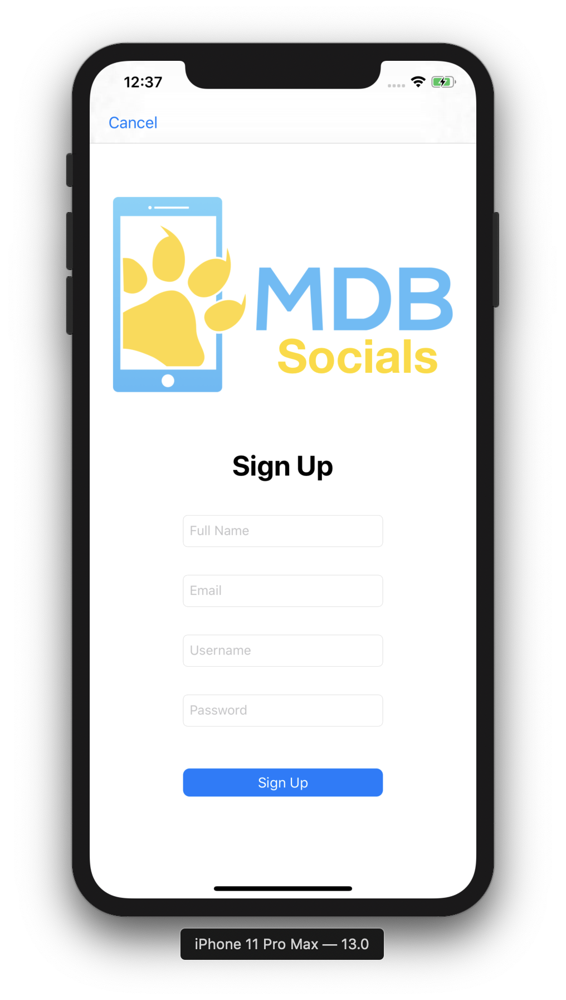
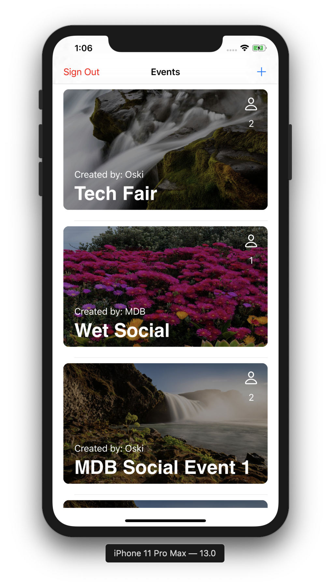
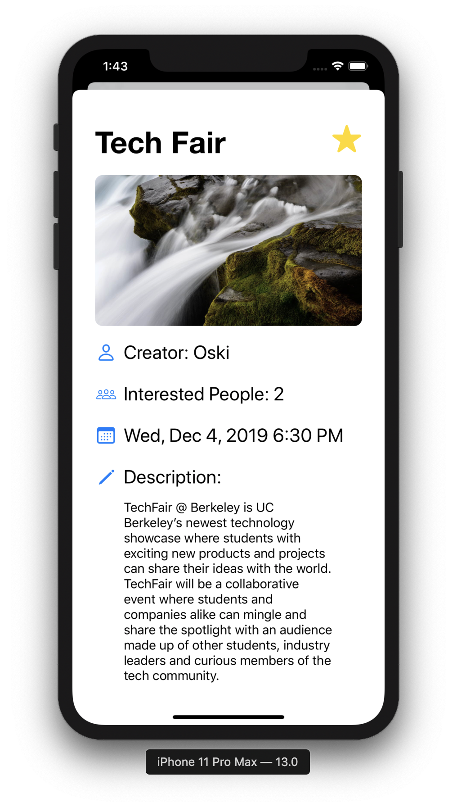
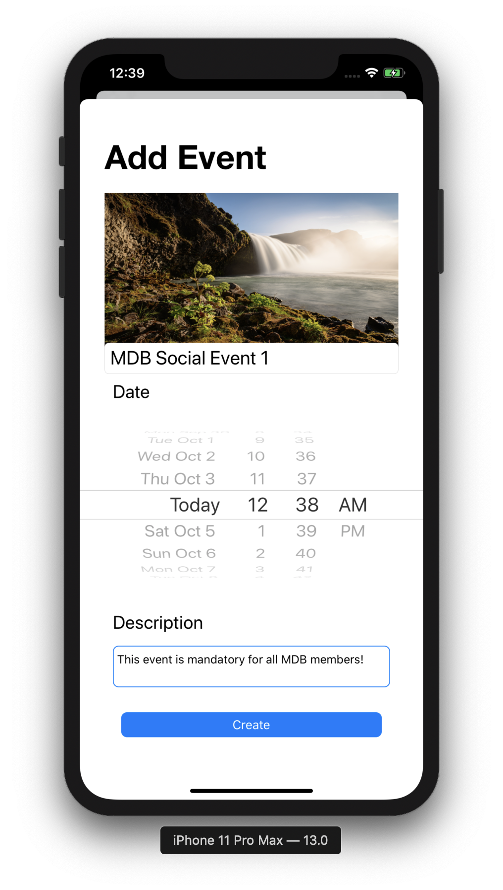

# MDB Mini Project 3 - MDB Socials

In this project, I users can log in or create accounts from which they can create events (with an image, title, date, and description). These events are visible to all users of the app. Users can view a list of all events and click them individually to get more details. There, they can choose to RSVP as interested in the event. This automatically updates the value that tells all users how many users are interested in each event.

Sign Up Screen

Event Feed Screen

Event Details Screen

New Event Screen

